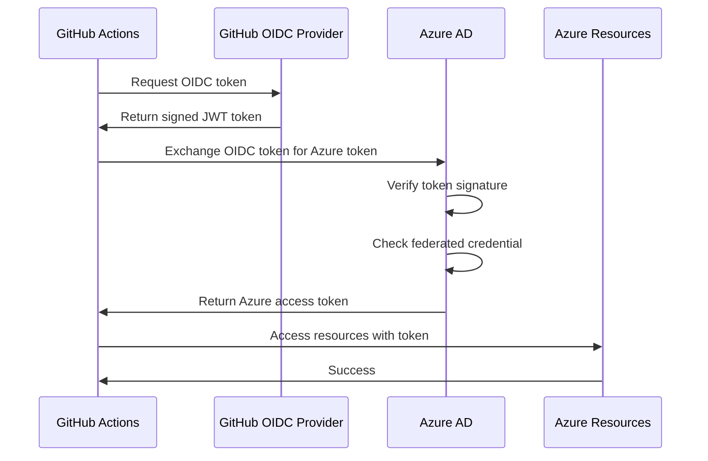

# GitHub OIDC with Azure Workload Identity Guide

This guide explains how to use GitHub Actions with Azure Workload Identity (OIDC) for passwordless, keyless authentication to deploy your Fast Azure application.

## 📋 Table of Contents

- [Overview](#overview)
- [Benefits](#benefits)
- [How It Works](#how-it-works)
- [Setup](#setup)
- [GitHub Actions Configuration](#github-actions-configuration)
- [Permissions Granted](#permissions-granted)
- [Troubleshooting](#troubleshooting)
- [Security Best Practices](#security-best-practices)

---

## Overview

**Workload Identity** enables applications running outside of Azure (like GitHub Actions) to access Azure resources without using secrets or keys. Instead, it uses OpenID Connect (OIDC) tokens for authentication.

### What Gets Created

When you deploy with a GitHub repository parameter, the infrastructure automatically creates:

1. **Managed Identity** - `fastazure-dev-github-identity`
2. **Federated Credential** - Links the identity to your GitHub repository
3. **Role Assignments** - Grants the identity necessary permissions:
   - Key Vault Secrets User (read secrets)
   - ACR Pull (pull container images)
   - AKS Contributor (manage cluster)

---

## Benefits

### Traditional Approach (Service Principal with Secrets)
❌ Secrets stored in GitHub  
❌ Manual secret rotation  
❌ Risk of exposure  
❌ Expiration management  
❌ Can be leaked in logs  

### Workload Identity (OIDC)
✅ **No secrets stored** - Just client/tenant/subscription IDs  
✅ **No rotation needed** - Tokens are short-lived (1 hour)  
✅ **More secure** - Tokens can't be reused outside GitHub  
✅ **Easier management** - No expiration to track  
✅ **Better audit** - Azure AD tracks all auth attempts  

---

## How It Works



**Key Points:**
1. GitHub Actions requests an OIDC token from GitHub
2. The token includes claims about the repository, branch, etc.
3. Azure AD verifies the token and checks the federated credential
4. If valid, Azure AD issues an Azure access token
5. GitHub Actions uses the Azure token to access resources

---

## Setup

### Step 1: Deploy Infrastructure with GitHub Repository

```bash
cd infrastructure/bicep

# Set your GitHub repository (format: owner/repo)
export GITHUB_REPOSITORY="your-org/fast_azure"

# Deploy
./deploy.sh
```

**What happens:**
- Creates AKS with Workload Identity enabled
- Creates Managed Identity for GitHub
- Creates Federated Credential linking GitHub → Azure
- Grants necessary permissions to the identity

### Step 2: Get Credentials from Deployment Output

After deployment, you'll see:

```
GitHub Identity:   fastazure-dev-github-identity
Client ID:         abc123-def4-5678-90ab-cdef12345678
OIDC Issuer:       https://oidc.prod-aks.azure.com/...

GitHub Secrets to Add:
AZURE_CLIENT_ID:        abc123-def4-5678-90ab-cdef12345678
AZURE_TENANT_ID:        your-tenant-id
AZURE_SUBSCRIPTION_ID:  your-subscription-id
```

### Step 3: Add Secrets to GitHub

1. Go to your GitHub repository
2. Navigate to **Settings** → **Secrets and variables** → **Actions**
3. Click **New repository secret**
4. Add these three secrets:

| Secret Name | Value | Description |
|------------|-------|-------------|
| `AZURE_CLIENT_ID` | `abc123-...` | Managed Identity Client ID |
| `AZURE_TENANT_ID` | `your-tenant-id` | Azure AD Tenant ID |
| `AZURE_SUBSCRIPTION_ID` | `your-sub-id` | Azure Subscription ID |

**Important:** These are NOT sensitive secrets - they are just identifiers. The actual authentication happens via OIDC tokens.

### Step 4: Use in GitHub Actions

A sample workflow has been created at `.github/workflows/deploy.yml`. Key parts:

```yaml
permissions:
  id-token: write  # Required for OIDC
  contents: read

steps:
  - uses: azure/login@v1
    with:
      client-id: ${{ secrets.AZURE_CLIENT_ID }}
      tenant-id: ${{ secrets.AZURE_TENANT_ID }}
      subscription-id: ${{ secrets.AZURE_SUBSCRIPTION_ID }}
```

---

## GitHub Actions Configuration

### Minimal Workflow

```yaml
name: Deploy to Azure

on:
  push:
    branches: [main]

permissions:
  id-token: write  # REQUIRED for OIDC
  contents: read

jobs:
  deploy:
    runs-on: ubuntu-latest
    steps:
      - uses: actions/checkout@v4
      
      - name: Azure Login
        uses: azure/login@v1
        with:
          client-id: ${{ secrets.AZURE_CLIENT_ID }}
          tenant-id: ${{ secrets.AZURE_TENANT_ID }}
          subscription-id: ${{ secrets.AZURE_SUBSCRIPTION_ID }}
      
      - name: Azure CLI commands
        run: |
          az account show
          az group list
```

### Full Deployment Workflow

See `.github/workflows/deploy.yml` for a complete example that:
- Builds and pushes Docker images to ACR
- Retrieves secrets from Key Vault
- Creates Kubernetes secrets
- Deploys to AKS
- Verifies deployment

---

## Permissions Granted

The GitHub OIDC identity has these permissions:

### 1. Key Vault Secrets User

**What it allows:**
- Read secrets from Key Vault
- Get secret values
- List secrets

**What it does NOT allow:**
- Create/update/delete secrets
- Manage Key Vault configuration
- Access keys or certificates

**Usage:**
```bash
# In GitHub Actions
az keyvault secret show \
  --vault-name $KEY_VAULT_NAME \
  --name mongodb-uri \
  --query value -o tsv
```

### 2. ACR Pull

**What it allows:**
- Pull images from ACR
- Build images using `az acr build`

**What it does NOT allow:**
- Push images manually (but `az acr build` works)
- Delete images
- Manage ACR configuration

**Usage:**
```bash
# In GitHub Actions
az acr build \
  --registry $ACR_NAME \
  --image myapp:latest \
  --file Dockerfile \
  .
```

### 3. AKS Contributor

**What it allows:**
- Get AKS credentials
- Update deployments
- View cluster resources
- Manage pods, services, etc.

**What it does NOT allow:**
- Delete the AKS cluster
- Change cluster configuration
- Modify RBAC settings

**Usage:**
```bash
# In GitHub Actions
az aks get-credentials \
  --resource-group $RESOURCE_GROUP \
  --name $AKS_CLUSTER

kubectl get pods -n fastazure
kubectl set image deployment/backend backend=image:tag
```

---

## Customizing Permissions

### Add More Repositories

To allow multiple repositories to use the same identity:

```bash
# Get identity name
IDENTITY_NAME="fastazure-dev-github-identity"

# Add another federated credential
az identity federated-credential create \
  --identity-name $IDENTITY_NAME \
  --resource-group fastazure-rg \
  --name github-federated-credential-repo2 \
  --issuer https://token.actions.githubusercontent.com \
  --subject repo:another-org/another-repo:ref:refs/heads/main \
  --audiences api://AzureADTokenExchange
```

### Allow Pull Requests

By default, only the `main` branch can authenticate. To allow PRs:

```bash
# Update subject to allow PRs
az identity federated-credential create \
  --identity-name $IDENTITY_NAME \
  --resource-group fastazure-rg \
  --name github-federated-credential-pr \
  --issuer https://token.actions.githubusercontent.com \
  --subject repo:your-org/your-repo:pull_request \
  --audiences api://AzureADTokenExchange
```

### Allow Specific Environments

```bash
# Only allow production environment
az identity federated-credential create \
  --identity-name $IDENTITY_NAME \
  --resource-group fastazure-rg \
  --name github-federated-credential-prod \
  --issuer https://token.actions.githubusercontent.com \
  --subject repo:your-org/your-repo:environment:production \
  --audiences api://AzureADTokenExchange
```

### Grant Additional Permissions

```bash
# Example: Grant storage access
az role assignment create \
  --role "Storage Blob Data Contributor" \
  --assignee $(az identity show --name $IDENTITY_NAME --resource-group fastazure-rg --query principalId -o tsv) \
  --scope /subscriptions/$SUBSCRIPTION_ID/resourceGroups/fastazure-rg
```

---

## Troubleshooting

### Error: "AADSTS70021: No matching federated identity record found"

**Cause:** The OIDC token claims don't match any federated credential.

**Solution:**
```bash
# Check your federated credentials
az identity federated-credential list \
  --identity-name fastazure-dev-github-identity \
  --resource-group fastazure-rg

# Verify the subject matches your workflow
# Format: repo:owner/repo:ref:refs/heads/main
```

**Common issues:**
- Wrong repository name (check case sensitivity)
- Wrong branch name (must be `refs/heads/main`, not just `main`)
- Running from a PR without a PR-specific credential

### Error: "insufficient privileges to complete the operation"

**Cause:** The identity doesn't have the required permissions.

**Solution:**
```bash
# Check current role assignments
az role assignment list \
  --assignee $(az identity show --name fastazure-dev-github-identity --resource-group fastazure-rg --query principalId -o tsv)

# Grant additional permissions if needed
az role assignment create \
  --role "Contributor" \
  --assignee $(az identity show --name fastazure-dev-github-identity --resource-group fastazure-rg --query principalId -o tsv) \
  --scope /subscriptions/$SUBSCRIPTION_ID/resourceGroups/fastazure-rg
```

### Error: "The resource principal does not exist"

**Cause:** GitHub secrets are wrong or managed identity was deleted.

**Solution:**
```bash
# Get the correct client ID
az identity show \
  --name fastazure-dev-github-identity \
  --resource-group fastazure-rg \
  --query clientId -o tsv

# Update GitHub secret with correct value
```

### Workflow Fails: "Error: Login failed with Error: OIDC token not provided"

**Cause:** Missing `id-token: write` permission in workflow.

**Solution:**
Add to your workflow:
```yaml
permissions:
  id-token: write  # REQUIRED
  contents: read
```

### Debug OIDC Token

To see what claims are in the OIDC token:

```yaml
- name: Debug OIDC Token
  run: |
    OIDC_TOKEN=$(curl -H "Authorization: bearer $ACTIONS_ID_TOKEN_REQUEST_TOKEN" "$ACTIONS_ID_TOKEN_REQUEST_URL&audience=api://AzureADTokenExchange" | jq -r '.value')
    echo $OIDC_TOKEN | cut -d'.' -f2 | base64 -d | jq
```

---

## Security Best Practices

### 1. Principle of Least Privilege

Only grant the minimum permissions needed:
- ✅ Key Vault Secrets **User** (not Officer)
- ✅ ACR **Pull** (not Push, unless needed)
- ✅ AKS **Contributor** (not Owner)

### 2. Limit Federated Credential Scope

Be specific about what can authenticate:
```bash
# ✅ Good: Specific branch
subject: repo:org/repo:ref:refs/heads/main

# ❌ Bad: Any branch
subject: repo:org/repo:ref:refs/heads/*

# ✅ Good: Specific environment
subject: repo:org/repo:environment:production

# ❌ Bad: Any pull request
subject: repo:org/repo:pull_request
```

### 3. Use Environments for Protection

GitHub environments add manual approval gates:

```yaml
jobs:
  deploy:
    runs-on: ubuntu-latest
    environment: production  # Requires approval
    steps:
      - uses: azure/login@v1
        # ...
```

Configure in: **Settings → Environments → New environment → Protection rules**

### 4. Monitor Authentication

Enable Azure AD sign-in logs:
```bash
az monitor diagnostic-settings create \
  --name aad-signin-logs \
  --resource $(az account show --query id -o tsv) \
  --workspace $LOG_ANALYTICS_ID \
  --logs '[{"category": "SignInLogs","enabled": true}]'
```

Query logs:
```bash
az monitor log-analytics query \
  --workspace $LOG_ANALYTICS_ID \
  --analytics-query "SigninLogs | where AppDisplayName == 'Azure CLI' | take 100"
```

### 5. Regular Audits

Review role assignments quarterly:
```bash
# List all permissions for GitHub identity
az role assignment list \
  --all \
  --assignee $(az identity show --name fastazure-dev-github-identity --resource-group fastazure-rg --query principalId -o tsv) \
  --output table
```

### 6. Separate Identities for Environments

For production, create separate identities:
```bash
# Production identity (stricter permissions)
az identity create \
  --name fastazure-prod-github-identity \
  --resource-group fastazure-prod-rg

# Only allow 'production' environment
az identity federated-credential create \
  --identity-name fastazure-prod-github-identity \
  --resource-group fastazure-prod-rg \
  --name github-prod-credential \
  --issuer https://token.actions.githubusercontent.com \
  --subject repo:your-org/your-repo:environment:production \
  --audiences api://AzureADTokenExchange
```

---

## Comparison: OIDC vs Service Principal

| Feature | OIDC (Workload Identity) | Service Principal + Secret |
|---------|--------------------------|----------------------------|
| **Setup Complexity** | Medium (one-time) | Simple |
| **Secrets in GitHub** | None (just IDs) | Password/certificate |
| **Token Lifetime** | 1 hour (auto-renewed) | Until secret expires |
| **Rotation** | Not needed | Manual rotation required |
| **Security** | ✅ More secure | ⚠️ Less secure |
| **Audit Trail** | Full in Azure AD | Limited |
| **Multi-repo** | Easy to share | Hard to manage |
| **Cost** | Free | Free |

**Recommendation:** Use OIDC for all new projects.

---

## Examples

### Deploy Only on Tagged Releases

```yaml
on:
  push:
    tags:
      - 'v*'

# Create federated credential with:
# subject: repo:org/repo:ref:refs/tags/v*
```

### Deploy to Multiple Environments

```yaml
jobs:
  deploy-dev:
    environment: development
    # Uses dev identity
  
  deploy-prod:
    environment: production
    needs: deploy-dev
    # Uses prod identity
```

### Conditional Deployment

```yaml
- name: Deploy to Production
  if: github.ref == 'refs/heads/main' && github.event_name == 'push'
  # Only deploy on push to main
```

---

## Additional Resources

- [Azure Workload Identity Documentation](https://learn.microsoft.com/en-us/azure/aks/workload-identity-overview)
- [GitHub OIDC with Azure](https://docs.github.com/en/actions/deployment/security-hardening-your-deployments/configuring-openid-connect-in-azure)
- [Azure Login Action](https://github.com/marketplace/actions/azure-login)
- [Federated Identity Credentials](https://learn.microsoft.com/en-us/azure/active-directory/develop/workload-identity-federation)

---

## Summary

With Workload Identity enabled:
- ✅ AKS has OIDC issuer enabled
- ✅ GitHub can authenticate without secrets
- ✅ Managed identity has Key Vault Secrets User role
- ✅ Managed identity has ACR Pull access
- ✅ Managed identity can manage AKS
- ✅ Sample workflow ready to use

**Next Steps:**
1. Deploy infrastructure with `GITHUB_REPOSITORY` set
2. Add Azure credentials to GitHub secrets
3. Push code to trigger workflow
4. Monitor deployment in GitHub Actions

---

For more information, see:
- [KEY_VAULT_GUIDE.md](./KEY_VAULT_GUIDE.md) - Key Vault integration
- [AZURE_DEPLOYMENT.md](./AZURE_DEPLOYMENT.md) - Complete deployment guide

